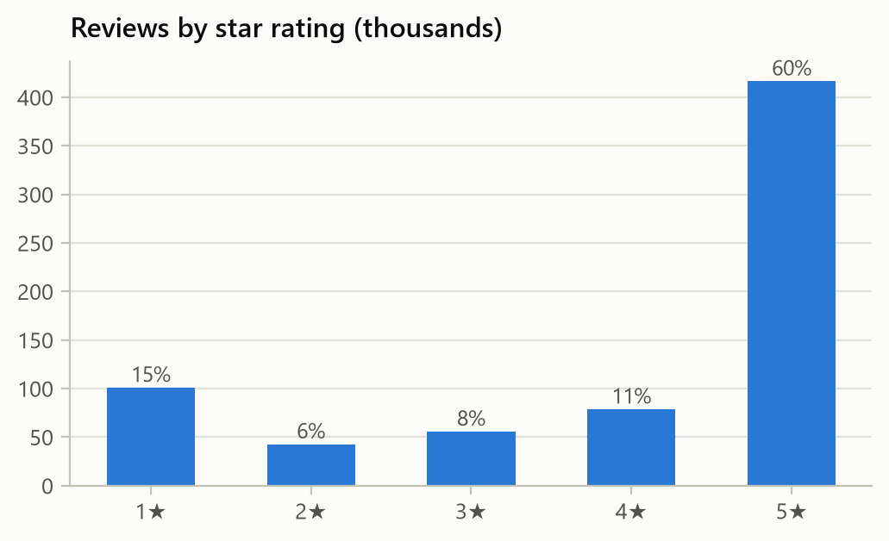
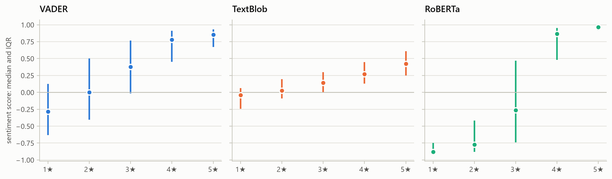
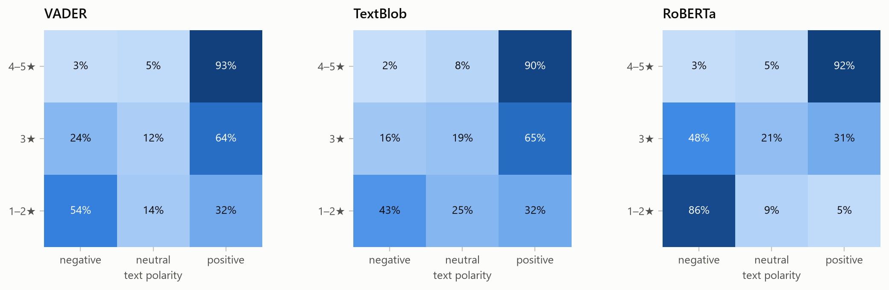
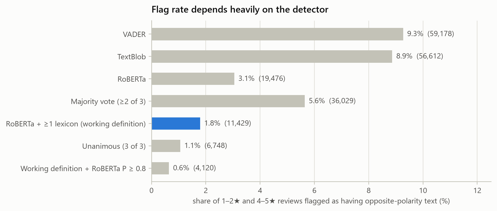
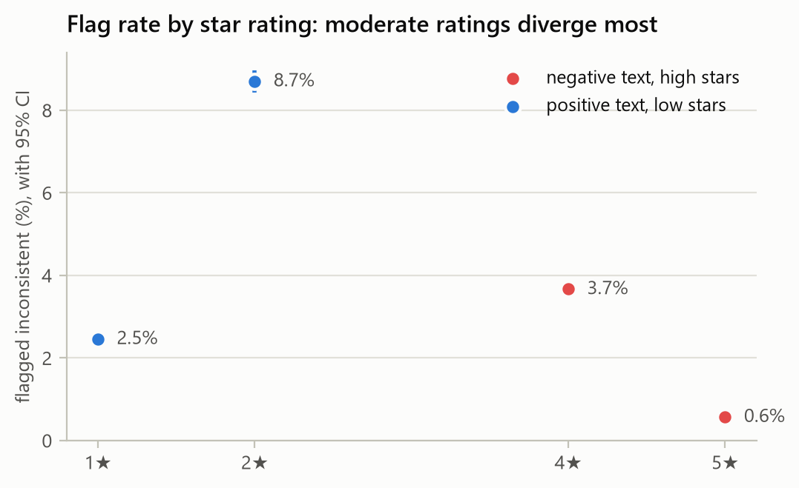
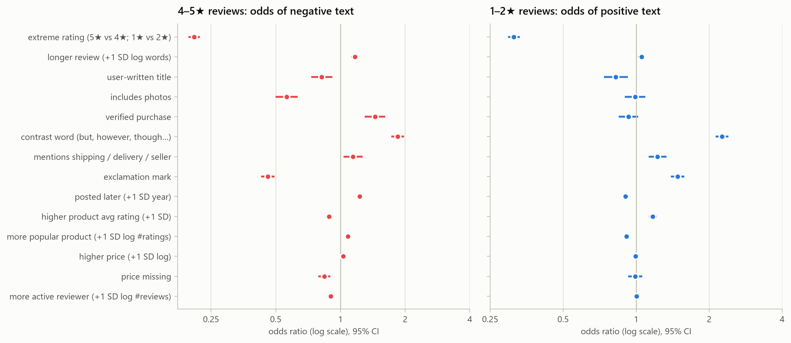
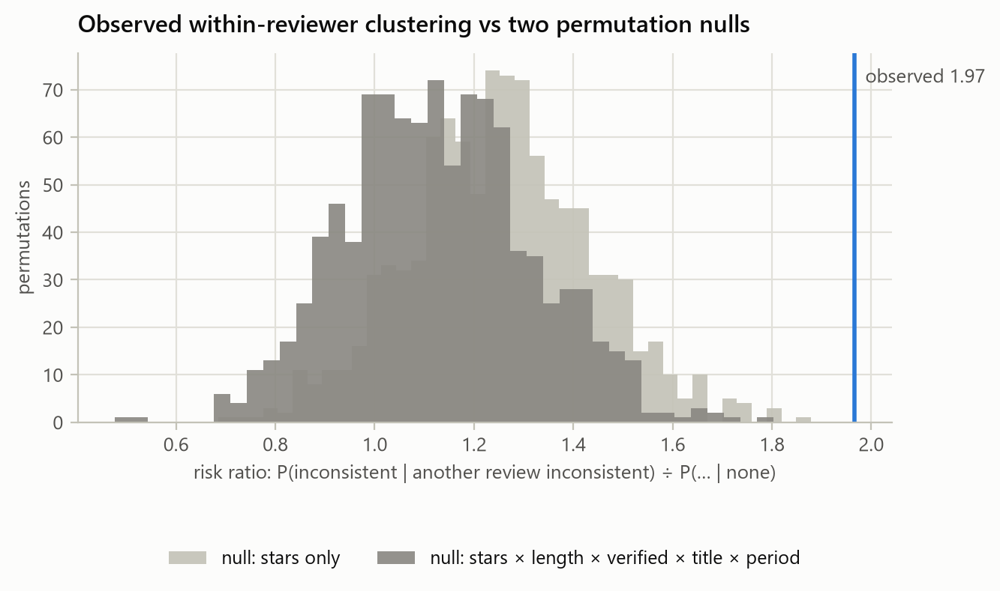
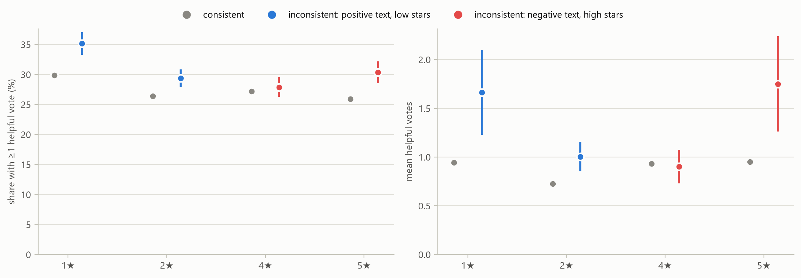
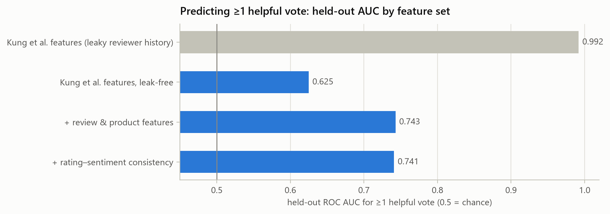

# Do Amazon star ratings agree with what reviewers write?

*Measuring rating–sentiment consistency in Amazon Reviews '23 (All_Beauty, 694,252 reviews)*

## Summary

**1. How often do ratings and text disagree?** Rarely, and far less often than off-the-shelf
sentiment tools suggest. Depending on the tool, 0.6% to 9.3% of 1–2★ and 4–5★ reviews are flagged as
having text of the opposite polarity. A naive vote of three sentiment models flags 5.6%. A manual
audit shows that most of these flags are model errors or genuinely mixed reviews. The audit-adjusted
estimate of genuine reversals is **≈0.8% of polar reviews (95% interval 0.6–1.0%)**, about 5,000
reviews:

* ≈0.8% of 4–5★ reviews have negative text
* ≈0.6% of 1–2★ reviews have positive text

**2. What predicts disagreement?** Above all, **moderate ratings**. Adjusting for other factors, a 4★
review has about 5× the odds of a 5★ review of carrying negative text. A 2★ review has about 3× the
odds of a 1★ review of carrying positive text. The other main predictors:

* **Both directions:** contrast words ("but", "however") and mentions of shipping, delivery or the
  seller predict disagreement.
* **4–5★ reviews with negative text** are more likely for verified purchases, for products with a
  lower average rating, and in more recent years. They are less likely when the review has photos or
  exclamation marks, and when the reviewer is more active.
* **1–2★ reviews with positive text** are more likely when the review has exclamation marks and when
  the product's average rating is high.

**3. Are some reviewers systematically inconsistent?** There is a real but small tendency. A review is
about **twice as likely** to be flagged if the same reviewer's other reviews include a flagged one
(risk ratio 1.97). Permutation nulls that preserve the kinds of reviews each person writes predict only
1.13–1.25 (p < 0.001). A reviewer's *earlier* inconsistency also predicts their next review (odds
ratio 1.8). Still, inconsistency is rare, so repeat-inconsistent reviewers are few: 26 of the 6,852
reviewers with 3 or more polar reviews, versus about 22 expected by chance. There is no distinct
population of reviewers whose stars ignore their words. How closely each reviewer's stars track their
text matches what sampling noise alone would produce.

**4. Are inconsistent reviews more or less helpful?** **4–5★ reviews with negative text are *more*
helpful.** With controls, they receive 42% more helpful votes (rate ratio 1.42, 95% CI 1.18–1.71) and
have 15% higher odds of receiving any vote. Comparing reviews of the same product only, the gap is +1.4
percentage points (p = 0.055). **1–2★ reviews with positive text show no reliable difference.**
Consistency features do not improve the *prediction* of helpfulness.

**5. Revisiting Kung et al. (2024).** Their 0.969 accuracy for predicting ≥1 helpful vote is
reproduced exactly (0.969), but it comes from **target leakage**: the reviewer-history feature includes
the review being predicted. Rebuilt from earlier reviews only, accuracy is 0.743, against 0.733 for
always predicting "no vote", and AUC falls from 0.992 to 0.625.

---

## 1. Questions and sources

The project asks four questions about Amazon reviews:

1. How often does a reviewer's numerical rating disagree with the sentiment of their written review?
2. What factors predict these disagreements?
3. Are some reviewers systematically more likely to give ratings that disagree with their text?
4. Are those reviews more or less helpful?

**Data.** The source is Amazon Reviews '23 (Hou et al., 2024; McAuley Lab, UCSD), *All_Beauty*
category, with item metadata. It is the category analysed by **Kung, Orlando & Kirimlioglu (2024)**,
who predicted helpful votes from review metadata and TextBlob sentiment. That paper did not measure
rating–text consistency. It found TextBlob sentiment weakly related to helpfulness and dropped it.
This project builds the consistency measure the paper lacked, checks it by hand, and revisits the
paper's helpfulness result.

## 2. Data and cleaning

| | |
|---|---|
| Raw reviews | 701,528, matching Kung et al.'s per-star counts and helpful-vote means exactly |
| Exact duplicates removed | 7,276 (same reviewer, product, time, rating, title and text) |
| Reviews analysed | **694,252** by 631,986 reviewers on 112,565 products, Nov 2000 – Sep 2023 |
| Polar reviews (1–2★ or 4–5★) | **638,532** |
| Star distribution | 5★ 60.0% · 4★ 11.3% · 3★ 8.0% · 2★ 6.1% · 1★ 14.5% |
| Median length | 23 words; 26.7% of reviews have ≥1 helpful vote |
| Reviewers with a single review | 93.2% of reviewers, writing 84.8% of reviews |

**Auto-generated titles.** 74,564 reviews (10.7%) carry an auto-generated title such as "Five
Stars". Amazon filled empty titles this way, mostly between 2014 and 2018, when 21–34% of each
year's reviews had one. These titles copy the rating into the text, which would make ratings and text
look more consistent than the reviewer wrote them, so they were blanked. HTML markup was stripped. The
sentiment models read the title and body together.

## 3. Measuring disagreement

### 3.1 Three sentiment models

| model | kind | AUC, 4–5★ vs 1–2★ | Spearman ρ with stars |
|---|---|---|---|
| VADER (Hutto & Gilbert, 2014) | lexicon + rules | 0.905 | 0.57 |
| TextBlob (the tool Kung et al. used) | lexicon | 0.890 | 0.58 |
| **RoBERTa** (`cardiffnlp/twitter-roberta-base-sentiment-latest`) | transformer, 3-class | **0.985** | **0.76** |
| Average of the three (z-scored) | ensemble | 0.971 | 0.71 |

None of these models was trained on Amazon star ratings. That was deliberate: a model trained on
stars learns to reproduce them, noise included, and would hide the very disagreements under study.

RoBERTa is by far the most valid measure. Averaging it with the lexicons makes it *worse*. RoBERTa
scored all 694K reviews in about 15 minutes on the laptop's Intel Arc integrated GPU via OpenVINO; the
CPU would have taken about 8 hours. On a 2,000-review check, the GPU labels were identical to PyTorch
on the CPU. Reviews longer than 256 tokens (1.2%) were truncated to their first 128 and last 126
tokens.

### 3.2 Why a simple majority vote fails

The obvious rule is to call a review inconsistent when at least 2 of the 3 models find
opposite-polarity text. It flags 5.6% of polar reviews. **68% of those flags come from VADER and
TextBlob agreeing while RoBERTa disagrees**, and 93% of those are 1–2★ reviews.

The two lexicons are not independent votes. Both score individual words, so both misread negative
reviews built from positive words, such as "Don't waste your money", "Wouldn't buy again" and "Don't
listen to the 'good' reviews". The lexicons call about a third of 1–2★ reviews positive. RoBERTa calls
5% positive.

### 3.3 Manual audit of the detector

In all, 250 reviews were sampled at random within each flag stratum and labelled by hand. Each label
records whether the text's *overall evaluation* runs opposite to the stars:

* **I** (inconsistent): the verdict clearly runs opposite to the stars
* **M** (mixed): praise and complaints, with the stars a defensible summary
* **C** (consistent): a model error
* **U** (unclear)

Round 1 (90 reviews) was exploratory. Rounds 2 and 3 (160 reviews) were **blinded**: only the stars
and the text were visible, with strata shuffled together.

| stratum | audited | genuinely inconsistent | inconsistent or mixed |
|---|---|---|---|
| Lexicon pair only (VADER + TextBlob, not RoBERTa) | 30 | **0%** (95% CI 0–11%) | 10% |
| One lexicon only | 30 | **0%** | 0% |
| Not flagged by any model | 20 | **0%** | 0% |
| RoBERTa only, 4–5★ | 28 | **25%** (13–43%) | 50% |
| **RoBERTa + ≥1 lexicon, 4–5★** | 70 | **41%** (31–53%) | 70% |
| **RoBERTa + ≥1 lexicon, 1–2★** | 70 | **14%** (8–24%) | 40% |

The audit leads to four conclusions:

* **Lexicon-only flags are noise.**
* **RoBERTa carries the signal.** For 1–2★ reviews, even RoBERTa-backed flags are mostly mixed
  reviews that open with praise before the complaint ("Great color! But peeled after one day").
* Precision rises with RoBERTa's confidence: at P(opposite) ≥ 0.8 it reaches 64% for 4–5★ flags and
  28% for 1–2★ flags.
* **Caveat.** The labeller was the AI assistant that built the pipeline, not an independent human
  annotator. `reports/validation_sample.csv` provides 300 fresh reviews, with blank label columns, for
  human checking.

### 3.4 Definitions used

* **`inconsistent`** (working definition): RoBERTa finds opposite-polarity text **and** at least one
  lexicon agrees. It flags 11,429 reviews (1.79%).
* **`inconsistent_confident`**: the same, plus RoBERTa P(opposite) ≥ 0.8. It flags 4,120 reviews
  (0.65%) and serves as the high-precision robustness check.
* 3★ reviews are excluded, because a neutral rating has no opposite.

## 4. Results

### 4.1 How often? (Q1)

The flag rate depends heavily on the detector, from 9.3% (VADER alone) to 0.65% (confident flag). To
estimate how many reversals are *genuine*, each stratum's population was multiplied by its audited
precision. Uncertainty comes from Jeffreys posteriors:

| | estimated genuine reversals | share of these reviews |
|---|---|---|
| 4–5★ reviews with negative text | ≈4,080 (2,930–5,580) | **0.82%** (0.59–1.13%) |
| 1–2★ reviews with positive text | ≈880 (470–1,490) | **0.62%** (0.33–1.04%) |
| All polar reviews | ≈4,960 (3,740–6,600) | **0.78%** (0.59–1.03%) |

Strata where the audit found no genuine case contribute zero. The largest of these is the 546,043
reviews no model flags. The audit's 20-review sample there cannot rule out a small rate, so these
figures describe genuine reversals among reviews that at least one model flags.

**Where flags concentrate.** Flags cluster at moderate ratings: **2★ 8.7% and 4★ 3.7%, against 1★
2.5% and 5★ 0.6%**. Moderate ratings are where people write mixed reviews, and also where genuine
reversals are most common. Over time, 4–5★ flags rose from 0.8% in 2019 to 1.5% in 2023, while 1–2★
flags fell from 5–7% in the mid-2010s to about 3.5–3.9%.

**What genuine reversals look like.** The typology below covers the 46 audited reviews labelled I:

| direction | type | share | example |
|---|---|---|---|
| 4–5★, negative text (36) | product problem | 75% | 5★: "It broke right away. My lamp has broken already we used it 4 times." |
| | fulfilment / seller | 19% | 4★: "…Did nothing for me. However I’ve changed my review to 4 stars as they reimbursed me Immediately" |
| | price; update after failure | 6% | 5★: "HIGH COST of Razor Blades. VERY EXPENSIVE!" |
| 1–2★, positive text (10) | praise with low stars (likely misclick or reversed scale) | 80% | 1★: "Great. I love it" |
| | price; placeholder rating | 20% | 1★: "…ONLY GAVE ONE STAR BECAUSE HE HASN'T TRIED IT" |

High-star reversals are mostly **substantive**: the reviewer reports a failure but still rates highly,
or rates the seller's service rather than the product. Low-star reversals look mostly **mechanical**:
short, fully positive text with 1–2 stars.

### 4.2 What predicts disagreement? (Q2)

Separate logistic regressions were fit for each direction. Continuous predictors are standardised,
so each odds ratio is the effect of +1 SD; one SD of posting year is about 2.5 years. The table flags a
predictor as robust when it holds up under the high-precision flag.

| predictor | 4–5★: odds of negative text | 1–2★: odds of positive text | robust? |
|---|---|---|---|
| extreme rating (5★ vs 4★; 1★ vs 2★) | **0.21** | **0.31** | ✓ both |
| contrast word (but, however, though…) | **1.85** | **2.26** | ✓ both (1.44 / 1.98 confident) |
| mentions shipping / delivery / seller | 1.14 | 1.22 | ✓, *stronger* when confident (1.55 / 1.32) |
| verified purchase | **1.45** | 0.93 | ✓ for 4–5★ |
| includes photos | **0.56** | 0.99 | ✓ for 4–5★ |
| exclamation mark | **0.46** | **1.48** | ✓ both, opposite directions |
| higher product average rating (+1 SD) | 0.88 | 1.17 | ✓ both |
| posted later (+1 SD ≈ 2.5 years) | 1.23 | 0.90 | ✓ both |
| more active reviewer (+1 SD) | 0.90 | 1.00 | ✓ for 4–5★ |
| longer review (+1 SD) | 1.17 | 1.05 | ✗ vanishes when confident (1.02 / 0.87) |

The results suggest four interpretations:

* **Moderate ratings and contrast words** point to the mixed review. The reviewer weighs pros against
  cons, and whether the stars or the text "wins" varies.
* **Product reputation cuts both ways.** Negative text under high stars is more common for products
  the crowd rates *poorly*, and positive text under low stars for products the crowd rates *highly*.
  In both cases the text agrees with the crowd and the stars do not. This fits misclicks, lenient
  default ratings, or ratings aimed at something other than the product.
* **Shipping and seller mentions** strengthen under the stricter flag. That matches the audit, where
  about one in five genuine high-star reversals was a complaint about fulfilment, not the product.
* **Unverified reviews, and reviews with photos or exclamation marks, are more uniformly positive**
  among 4–5★ reviews.

Predictability is modest. The pseudo-R² is 0.10 for 4–5★ reviews and 0.08 for 1–2★ reviews. A
gradient-boosted model reaches a held-out AUC of 0.79 and 0.73. Rating extremity and contrast words
dominate its permutation importance.

**Distinctive terms.** The terms most over-represented in flagged reviews (log-odds with an
informative Dirichlet prior) are:

* 4–5★ flagged reviews: *not, but, bad, disappointed, broken, horrible, hate, wrong, hard to, terrible,
  broke, not good, not great, product but*
* 1–2★ flagged reviews: *great, love, loved, nice, beautiful, however, cute, amazing, works, perfect,
  ok, good*

### 4.3 Are some reviewers systematically inconsistent? (Q3)

Only 14% of polar reviews (90,228, from 37,109 reviewers) come from reviewers with two or more polar
reviews, so this analysis rests on a minority of the data.

| test | result |
|---|---|
| Leave-one-out concordance | P(flagged \| another of the reviewer's reviews flagged) = 3.2% vs 1.6% otherwise: **RR 1.97** |
| Permutation null, shuffling flags within star ratings | null RR 1.25 (95% range 0.89–1.62); **p < 0.001** |
| Permutation null within star × length × verified × title × period | null RR 1.13 (0.78–1.50); **p < 0.001** |
| Prior-only logit (53,119 reviews with an earlier polar review; controls for stars, length, verified, title, photos, contrast words, year) | earlier inconsistency, **OR 1.80** (1.35–2.39) |
| Reviewers with ≥3 polar reviews and ≥2 flagged | 26 observed vs 21.8 expected under the null |
| Within-reviewer Spearman ρ, stars vs text (1,222 reviewers with ≥5 reviews) | median 0.65; 8.0% have ρ ≤ 0, against **7.7% expected from noise** (range 6.3–8.7% over 20 null draws) |

**Interpretation.** Inconsistency clusters within reviewers more than chance allows, even after
matching on the kinds of reviews they write, and it predicts forward in time. It is a *tendency*,
though, not a type. Because the base rate is low, doubling it produces only a handful of
repeat-inconsistent reviewers. For active reviewers, the overall alignment between stars and words is
exactly what noise predicts, so there is no identifiable group whose ratings ignore their text. The
26 repeat-inconsistent reviewers are prolific (17 polar reviews on average), rate lower (mean 3.6★ vs
4.3★), are less often verified (50% vs 72%) and collect more helpful votes. With n = 26, this profile
is descriptive only.

### 4.4 Are inconsistent reviews more or less helpful? (Q4)

At every star level, flagged reviews are more likely than consistent ones to get at least one vote.
At 1★ and 5★ they also average far more votes. At 5★, 30.3% get at least one vote, against 25.9% of
consistent reviews, and they average 1.75 votes against 0.95. At 1★, the figures are 35.2% against
29.9%. At 4★ the difference is negligible: 27.9% against 27.2%, and 0.90 against 0.93 mean votes. Controlling for stars, length, title, photos, verified status,
year, product popularity and product rating gives these estimates:

| | votes: rate ratio (Poisson PML) | ≥1 vote: odds ratio | same product only: change in P(≥1 vote) |
|---|---|---|---|
| 4–5★ with negative text | **1.42** (1.18–1.71) | **1.15** (1.08–1.23) | +1.4 pp (−0.0 to +2.8; p = 0.055) |
| 1–2★ with positive text | 1.13 (0.97–1.33) | 0.97 (0.92–1.03) | +0.8 pp (−0.5 to +2.2) |
| *confident flag:* 4–5★ | 1.36 (0.95–1.95) | **1.15** (1.03–1.27) | |
| *confident flag:* 1–2★ | 1.29 (0.92–1.82) | 0.99 (0.89–1.09) | |

**Interpretation.** High-star reviews that voice real problems, such as a product that works but
broke, are modestly *more* helpful. They carry information shoppers want and do not find in
uniformly positive reviews. Part of the gap may reflect exposure, since helpful votes also depend on
how Amazon sorts and displays reviews. The within-product estimate is smaller and only borderline
significant. **Low-star reviews with positive text are neither more nor less helpful.** These are
mostly mixed reviews and misclicks, which readers neither reward nor punish.

### 4.5 Revisiting Kung et al.'s helpful-vote prediction

| features (gradient boosting, same 80/20 split) | accuracy | ROC AUC |
|---|---|---|
| always predict "no helpful vote" | 0.733 | 0.500 |
| Kung et al.: reviewer's mean helpful votes over **all** their reviews + images + timestamp | **0.969** | 0.992 |
| same, with reviewer history from **earlier** reviews only | 0.743 | 0.625 |
| + review and product features | 0.767 | 0.743 |
| + rating–sentiment consistency features | 0.767 | 0.741 |

The paper's 0.969 is reproduced exactly, and it is an artefact. For the 93% of reviewers with a single
review, "average helpful votes across the reviewer's reviews" *is* the target. Without the leak, the
paper's features barely beat the majority class. Consistency features add nothing to prediction,
although the association in §4.4 is real. The effect is small relative to exposure factors such as
length, photos and product popularity.

## 5. Limitations

* **One category.** All_Beauty may not generalise: electronics and books reviews differ in length and
  in what reviewers rate.
* **Measurement.** Every automated flag is noisy. The audit is small (250 reviews), and its labeller
  was an AI assistant rather than independent human annotators. Round 1 was unblinded. The prevalence
  estimate leaves out genuine reversals among reviews no model flags. These points bound how precisely
  §4.1 can be stated. A human-labelled validation (`reports/validation_sample.csv`) would tighten it.
* **Mixed reviews are a grey zone.** A 2★ review that praises the colour and complains about
  durability is arguably not "inconsistent". The working flag includes many such reviews. That is why
  the analyses are repeated with the high-precision flag, and why predictors that fade under it (such
  as length) are reported as not robust.
* **Text-derived predictors** such as contrast words, exclamation marks and length also change how
  well the sentiment models work (notebook 2). Their associations mix reviewer behaviour with
  measurement error.
* **Observational helpfulness.** Vote counts reflect Amazon's display and sorting, not only reader
  judgement. The within-product comparison controls for product traffic but not for position on the
  page.
* **Reviewer analysis power.** 93% of reviewers wrote one review in this category. Adding the same
  users' reviews from other categories would strengthen Q3 considerably.

## 6. Reproducing

Run `python run_pipeline.py` after installing `requirements.txt`; the [README](../README.md) has
step-by-step instructions for Windows, macOS and Linux. No GPU is needed: the RoBERTa scores ship in
`data/precomputed/`, and `--recompute-roberta` regenerates them on any supported hardware. Every
number in this report comes from the executed notebooks in `notebooks/`, and every figure is in
`reports/figures/`.

## References

* Hou, Y., Li, J., He, Z., Yan, A., Chen, X., & McAuley, J. (2024). Bridging Language and Items for
  Retrieval and Recommendation. arXiv:2403.03952. https://amazon-reviews-2023.github.io/
* Kung, H., Orlando, D., & Kirimlioglu, E. (2024). Were You Helpful – Predicting Helpful Votes from
  Amazon Reviews. arXiv:2412.02884.
* Hutto, C. J., & Gilbert, E. (2014). VADER: A Parsimonious Rule-based Model for Sentiment Analysis of
  Social Media Text. ICWSM.
* Loureiro, D., Barbieri, F., Neves, L., Espinosa Anke, L., & Camacho-Collados, J. (2022). TimeLMs:
  Diachronic Language Models from Twitter. ACL (demo).
* Monroe, B. L., Colaresi, M. P., & Quinn, K. M. (2008). Fightin' Words. Political Analysis 16(4).
* Sun, C., Qiu, X., Xu, Y., & Huang, X. (2019). How to Fine-Tune BERT for Text Classification? CCL.
